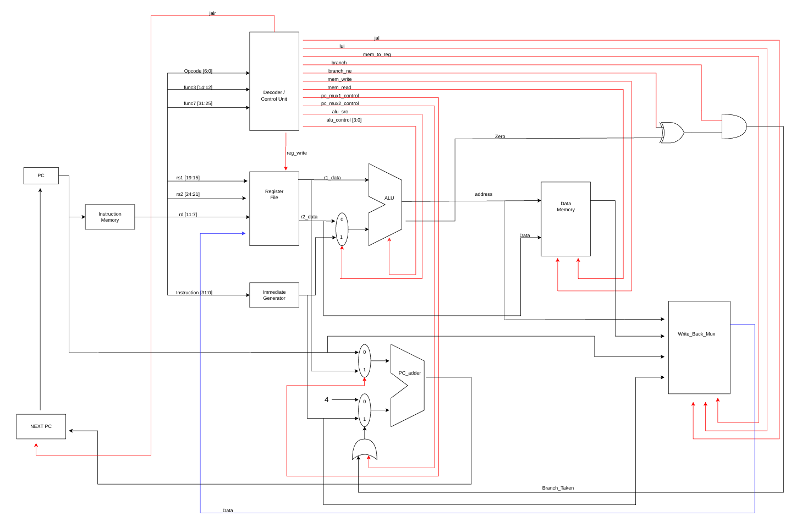

# RISCV-Single-Cycle-Processor
A modular 32-bit RISC-V single-cycle processor implemented in Verilog HDL. The processor follows a classic RISC-V Datapath architecture, with separate instruction and data memories, a register file, immediate generator, ALU, control/decoder logic, next pc generation, and write-back logic.

The design is written in a modular manner so that individual blocks can be simulated and verified independently and can later be combined into a complete module.
## Architecture

The processor is implemented as a 32-bit RISC-V single-cycle processor. 
Each instruction is completed within one clock cycle.

The datapath consists of the following major blocks:

- Program Counter (PC)
- Instruction Memory
- Decoder / Control Unit
- Register File
- Immediate Generator
- ALU
- ALU Input MUX
- Data Memory
- PC MUX 1
- PC MUX 2
- PC Adder
- Branch Taken Logic
- Write-Back MUX

### Single-Cycle Datapath

 
## Supported Instructions

| Instruction Class | Supported Instructions |
|---|---|
| **R-Type** | `ADD`, `SUB`, `AND`, `OR`, `XOR`, `SLL`, `SRL`, `SRA`, `SLT`, `SLTU` |
| **I-Type** | `ADDI`, `ANDI`, `ORI`, `XORI`, `SLLI`, `SRLI`, `SRAI`, `SLTI`, `SLTIU` |
| **Load / Store** | `LW`, `SW` |
| **Branch** | `BEQ`, `BNE` |
| **Jump** | `JAL`, `JALR` |
| **Upper Immediate** | `LUI` |
